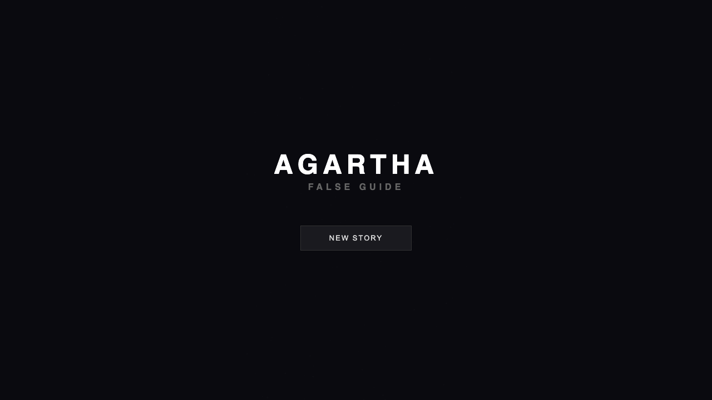
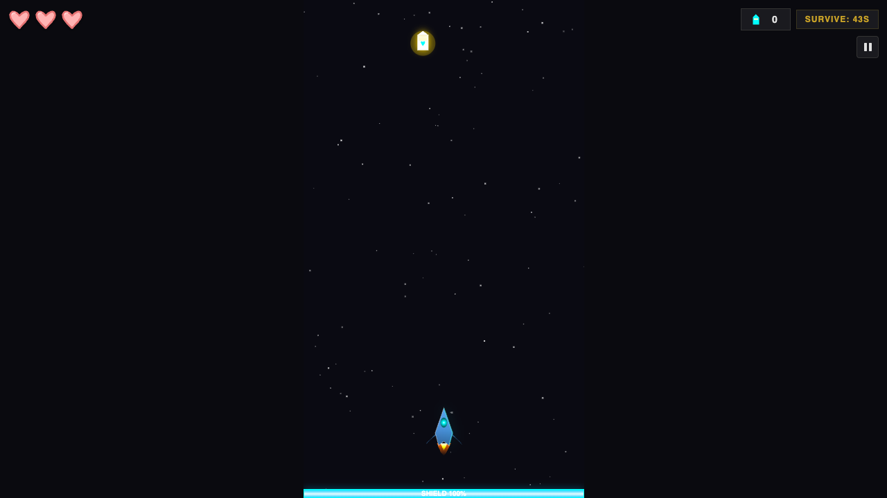
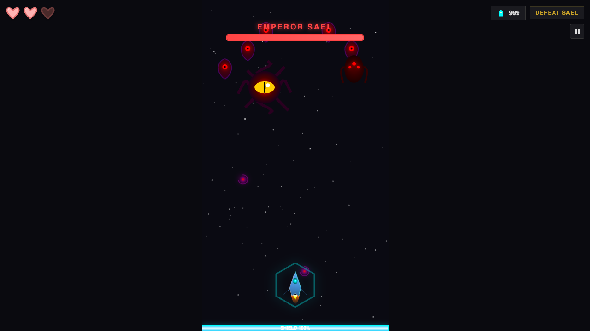

# Agartha: False Guide

**Agartha: False Guide** is a browser-based space shooter with a story campaign, dialogue scenes, upgrades, boss fights, and procedural canvas effects. It runs as a static site, so there is no backend, account system, API key, or build step required.

The game is built with vanilla JavaScript, ES modules, HTML5 Canvas, CSS, local audio files, and portrait assets.

## Screenshots

| Main Menu | Gameplay | Level 30 Boss |
| --- | --- | --- |
|  |  |  |

## Features

*   30-level story campaign.
*   Mission types for survival, collection, enemy waves, and boss fights.
*   Dialogue system with character portraits and voice ticks.
*   Player upgrades, Elixir currency, power-ups, shields, and persistent saves.
*   Keyboard, touch, and gamepad support.
*   Procedural Canvas rendering for enemies, projectiles, particles, shields, and backgrounds.
*   Web Audio music and generated sound effects.

## Play Locally

Clone the repository:

```bash
git clone https://github.com/mohakram555/ship-to-agartha.git
cd ship-to-agartha
```

Start a local server:

```bash
python3 -m http.server 8000
```

Open the game:

```text
http://localhost:8000
```

Do not open `index.html` directly with `file://`. Browsers often block ES module imports from local files, so the game should be served over HTTP.

## Controls

| Action | Keyboard | Gamepad | Touch |
| --- | --- | --- | --- |
| Move | `WASD` or arrow keys | Left stick or D-pad | On-screen joystick |
| Fire | `Space` | Cross / primary button or right trigger | `FIRE` button |
| Continue dialogue | `Enter` or `E` | Cross / primary button | Tap / `FIRE` button |
| Pause | `Esc` or `P` | Options / Start | Pause button |

## Developer Menu

The developer menu is hidden during normal play, but it is available for local testing.

To open it:

1.  Start or continue a level.
2.  Advance any story dialogue until the HUD is visible.
3.  Click the mission objective in the top-right HUD three times within three seconds.
4.  Click the `DEV` button that appears near the upper-right corner.

The menu includes theme selection, gameplay tuning sliders, invincibility, level navigation, restart, complete-level, and Elixir test controls.

## Project Structure

```text
.
├── index.html
├── css/
├── js/
│   ├── data/
│   ├── entities/
│   └── scenes/
├── assets/
│   ├── music/
│   ├── portraits/
│   └── screenshots/
├── tests/
└── deployment/
```

The main entry point is `js/main.js`. Game state lives in `js/state.js`, rendering lives in `js/renderer.js`, controls live in `js/input.js`, and campaign data lives in `js/data/levels.js`.

## Testing

Run the default checks:

```bash
npm test
```

Run the benchmark helper:

```bash
npm run benchmark
```

## Deployment

This is a static web project. Any host that can serve HTML, CSS, JavaScript, images, and MP3 files can host it.

Common options:

*   GitHub Pages, Netlify, Vercel, Cloudflare Pages, S3 static hosting, or any similar static host.
*   A VPS with Nginx using the templates in `deployment/`.
*   A custom deployment workflow based on `deployment/github-actions-deploy.example.yml`.

For VPS hosting, start with:

```bash
cp deployment/deploy.config.example deployment/deploy.config
```

Fill in your server details, then run:

```bash
./deployment/deploy.sh
```

More deployment references:

*   Full VPS guide: [deployment/VPS_SETUP.md](deployment/VPS_SETUP.md)
*   Nginx template: [deployment/nginx.conf](deployment/nginx.conf)
*   GitHub Actions template: [deployment/github-actions-deploy.example.yml](deployment/github-actions-deploy.example.yml)

Keep private server values in ignored local files such as `deployment/deploy.config`. Do not commit SSH keys, tokens, IP-specific configs, `.env` files, or generated logs.

## Contributing

Fork the project, make your changes, and run `npm test` before opening a pull request. Keep changes focused, and avoid committing local deployment files or generated artifacts.

## License

This project is released under the [Unlicense](LICENSE). You can use, modify, distribute, publish, or sell it for personal or commercial work without attribution requirements.
